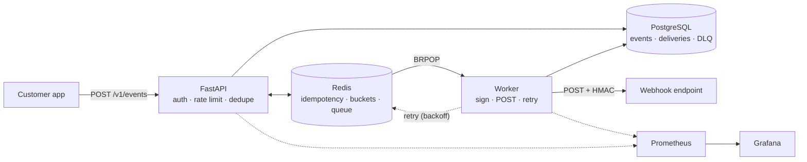

# Relayed

Relayed is a multi-tenant webhook service built with FastAPI, Postgres, and Redis that ensures safe and efficient delivery. The system uses HMAC-signed payloads, per-tenant rate limiting, and exponential backoff retries with idempotency-key deduplication to provide reliable delivery under failure.


## Architecture


Events are ingested by the FastAPI service, which authenticates the caller, checks the per-tenant rate limit, and deduplicates by idempotency key. The event is persisted alongside a `Delivery` row per matching subscription, then delivery IDs are pushed onto a Redis queue. A worker consumes the queue, signs the payload with HMAC-SHA256, POSTs to the subscription's destination, and retries with exponential backoff on failure. After the retry budget is exhausted, the delivery is written to the dead letter queue for manual replay.

## Features

- **HMAC-signed payloads**: every webhook signed with per-subscription secret using HMAC-SHA256
- **Per-tenant rate limiting**: token bucket algorithm implemented as a Redis Lua script with multiple tier options
- **Idempotency**: `Idempotency-Key` header deduplication via Redis `SET NX`, namespaced per tenant.
- **Exponential backoff retries**: worker retries failed deliveries with exponential backoff and jitter
- **Dead letter replay**: failed deliveries surface via `GET /v1/deadletter` and can be re-queued via `POST /v1/deadletter/{id}/replay`.
- **API key rotation**: `POST /v1/keys/rotate` issues a new key
- **Observability**: Prometheus metrics for delivery attempts, successes, failures, retries, and per-delivery latency, with Grafana dashboards.
- **Python SDK**: `pip install relayed` 


## SDK Usage

```python
from relayed import RelayedClient

client = RelayedClient(api_key=..., base_url=...)

subscription = client.create_subscription(
    destination_url="https://your-destination.example.com/webhook",
    event_types=["test.event"],
)

client.send_event(
    event_type="test.event",
    payload={"message": "test"},
    idempotency_key="some-unique-key",
)
```

## Curl Example
```bash
curl.exe -X POST http://18.207.144.60/v1/events \
  -H "Content-Type: application/json" \
  -H "Authorization: Bearer <Your API KEY>" \
  -d '{"destination_url": "https://your-destination.example.com/webhook", "event_type": "test.event", "payload": {"message": "test"}}'
```

## Engineering Decisions 

### HMAC Signing
Each outbound webhook is signed with HMAC-SHA256 using a per-destination secret and sent as an X-Relay-Signature header. The signature is 
computed over the exact request body bytes, so any tampering or forgery invalidates it. Without this, any attacker who knew a customer's webhook URL could send forged events
directly to their endpoint

### Observability with Prometheus
It was important for this project to include metrics. Metrics allow us to see the volume of outbound requests and track whether or not they are successfully reaching the endpoint. If not, we can actively see them being processed on the retry, and then easily know how many end up failing versus delivering.

### Idempotency Key
Each outbound webhook has an Idempotency-Key attached to it. The receiver tracks the keys that have already been processed and rejects duplicate events

### Exponential backoff for retries
When attempting retires there is the possibility that many requests will fail and thus retry at the same time. If 100-1000s of requests retried at the same time, the system would fail. And linear backoff for retries would cause the same issue. Therefore, we use exponential backoff to spread out retry requests. 

### Postgres + Redis
Postgres acts as the durable record for all events. If the server crashes, no events are lost, giving Relayed a delivery guarantee. However, polling rows where status="pending" is very slow, and that's where Redis comes in. Redis gives us fast O(1) queue of events, but Redis will lose queued IDs if it fails, necessitating Postgres


