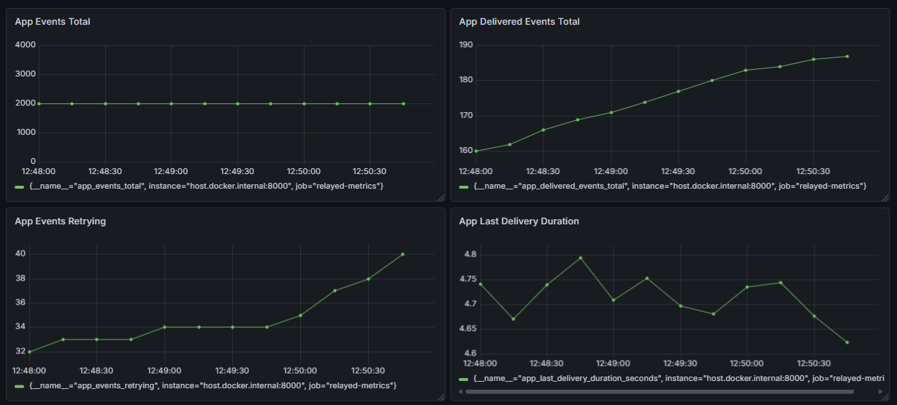
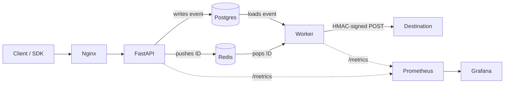

# Relayed

Relayed is a webhooks delivery service that ensures safe and efficient webhook delivery. The system uses HMAC-signed payloads and API key auth for security and exponential backoff with idempotency-key deduplication to provide reliable delivery under failure.

## Dashboard 



Real-time metrics exposed via Prometheus and visualized in Grafana: events accepted, deliveries succeeded/failed, retry queue depth, and end-to-end delivery latency. Load-tested at 2,000 concurrent requests.

## Architecture



## SDK Usage

```python
import Relayed
relayed = Relayed(api_key=..., base_url=...)
relayed.send_event(destination_url=..., event_type=..., payload={...})
```

## Curl Example
```bash
curl.exe -X POST http://18.207.144.60/v1/events \
  -H "Content-Type: application/json" \
  -H "Authorization: Bearer <Your API KEY>" \
  -d '{"destination_url": "https://your-destination.example.com/webhook", "event_type": "test.event", "payload": {"message": "test"}}'
```

