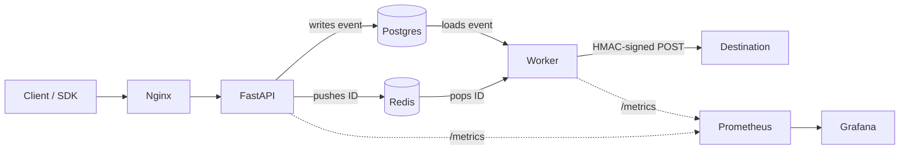

# Relayed

Relayed is a webhooks delivery service that ensures safe and efficient webhook delivery. The system uses HMAC-signed payloads and API key auth for security and exponential backoff with idempotency-key deduplication to provide reliable delivery under failure.

## Dashboard 


Real-time metrics exposed via Prometheus and visualized in Grafana: events accepted, deliveries succeeded/failed, retry queue depth, and end-to-end delivery latency. Load-tested at 2,000 concurrent requests.

## Architecture



## SDK Usage

```python
import Relayed
relayed = Relayed(api_key=..., base_url=...)
relayed.send_event(destination_url=..., event_type=..., payload={...})
```

## Curl Example
```bash
curl.exe -X POST http://18.207.144.60/v1/events \
  -H "Content-Type: application/json" \
  -H "Authorization: Bearer <Your API KEY>" \
  -d '{"destination_url": "https://your-destination.example.com/webhook", "event_type": "test.event", "payload": {"message": "test"}}'
```

## Engineering Decisions 

### HMAC Signing
Each outbound webhook is signed with HMAC-SHA256 using a per-destination secret and sent as an X-Relay-Signature header. The signature is 
computed over the exact request body bytes, so any tampering or forgery invalidates it. Without this, any attacker who knew a customer's webhook URL could send forged events
directly to their endpoint

### Observability with Prometheus
It was important for this project to include metrics. Metrics allow us to see the volume of outbound requests and track whether or not they are successfully reaching the endpoint. If not, we can actively see them being processed on the retry, and then easily know how many end up failing versus delivering.

### Idempotency Key
Each outbound webhook has an Idempotency-Key attached to it. The receiver tracks the keys that have already been processed and rejects duplicate events

### Exponential backoff for retries
When attempting retires there is the possibility that many requests will fail and thus retry at the same time. If 100-1000s of requests retried at the same time, the system would fail. And linear backoff for retries would cause the same issue. Therefore, we use exponential backoff to spread out retry requests. 

### Postgres + Redis
Postgres acts as the durable record for all events. If the server crashes, no events are lost, giving Relayed a delivery guarantee. However, polling rows where status="pending" is very slow, and that's where Redis comes in. Redis gives us fast O(1) queue of events, but Redis will lose queued IDs if it fails, necessitating Postgres


